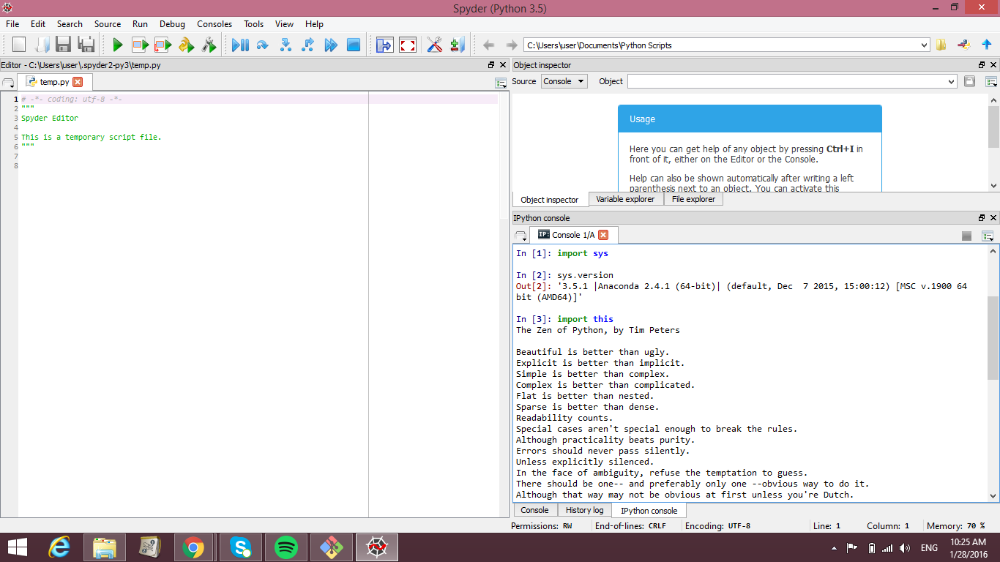

UECM3033 Assignment #1 Report
========================================================

- Prepared by: Lye Jia Wei
- Tutorial Group: T2

--------------------------------------------------------

## Task 1 -- setup a github repository

The reports, codes and supporting documents are uploaded to Github at: 

[https://github.com/lyejiawei/UECM3033_assign1](https://github.com/lyejiawei/UECM3033_assign1)

---------------------------------------------------------

## Task 2 -- setup python(python.png.png)

<<<<<<< HEAD

=======
(python.png)

>>>>>>> 259b7d1846702d2ffec052df3c51f8cd412851fa

------------------------------------------------------------

## Task 3 -- modify and run Python script

In this section, please report:

1. The hexadecimal value of my student ID.
<<<<<<< HEAD

2. Write down the definite integrals that I have chosen.

3. Write down my system of 10 linear equations.

Solution:
1. Hexadecimal representation of 1403855 is 0x156bcf

2. $$\int_0^{\infty} e^{-x}*{sqrt{x}} dx = \frac{\sqrt{\pi}}{2}.$$

3. 
\begin{align*}

3 x_0 + 1 x_1 + 6 x_2 + 0 x_3 + 4 x_4 + 3 x_5 + 2 x_6 + 8 x_7 + 9 x_8 + 5 x_9  &= 9,\\

1 x_0 + 2 x_1 + 7 x_2 + 0 x_3 + 8 x_4 + 4 x_5 + 2 x_6 + 9 x_7 + 4 x_8 + 1 x_9  &= 8,\\

3 x_0 + 6 x_1 + 5 x_2 + 5 x_3 + 6 x_4 + 8 x_5 + 0 x_6 + 2 x_7 + 9 x_8 + 1 x_9  &= 3,\\

4 x_0 + 5 x_1 + 7 x_2 + 8 x_3 + 3 x_4 + 2 x_5 + 1 x_6 + 0 x_7 + 5 x_8 + 8 x_9  &= 2,\\

1 x_0 + 2 x_1 + 0 x_2 + 4 x_3 + 3 x_4 + 5 x_5 + 6 x_6 + 7 x_7 + 8 x_8 + 3 x_9  &= 1,\\

5 x_0 + 3 x_1 + 3 x_2 + 6 x_3 + 7 x_4 + 9 x_5 + 2 x_6 + 1 x_7 + 3 x_8 + 0 x_9  &= 0,\\

1 x_0 + 2 x_1 + 3 x_2 + 8 x_3 + 6 x_4 + 3 x_5 + 4 x_6 + 5 x_7 + 0 x_8 + 9 x_9  &= 4,\\

2 x_0 + 2 x_1 + 5 x_2 + 8 x_3 + 7 x_4 + 4 x_5 + 4 x_6 + 0 x_7 + 9 x_8 + 1 x_9  &= 6,\\
2 x_0 + 3 x_1 + 7 x_2 + 8 x_3 + 4 x_4 + 5 x_5 + 3 x_6 + 6 x_7 + 0 x_8 + 1 x_9  &= 5,\\

5 x_0 + 6 x_1 + 7 x_2 + 8 x_3 + 3 x_4 + 2 x_5 + 1 x_6 + 4 x_7 + 5 x_8 + 3 x_9  &= 2.

=======
2. Write down the definite integrals that I have chosen.
3. Write down my system of 10 linear equations.

Solution:
1. Hexadecimal representation of 1403855 is 0x156bcf

2. $$\int_0^{\infty} e^{-x}*{sqrt{x}} dx = \frac{\sqrt{\pi}}{2}.$$

3. 
\begin{align*}
3 x_0 + 1 x_1 + 6 x_2 + 0 x_3 + 4 x_4 + 3 x_5 + 2 x_6 + 8 x_7 + 9 x_8 + 5 x_9  &= 9,\\
1 x_0 + 2 x_1 + 7 x_2 + 0 x_3 + 8 x_4 + 4 x_5 + 2 x_6 + 9 x_7 + 4 x_8 + 1 x_9  &= 8,\\
3 x_0 + 6 x_1 + 5 x_2 + 5 x_3 + 6 x_4 + 8 x_5 + 0 x_6 + 2 x_7 + 9 x_8 + 1 x_9  &= 3,\\
4 x_0 + 5 x_1 + 7 x_2 + 8 x_3 + 3 x_4 + 2 x_5 + 1 x_6 + 0 x_7 + 5 x_8 + 8 x_9  &= 2,\\
1 x_0 + 2 x_1 + 0 x_2 + 4 x_3 + 3 x_4 + 5 x_5 + 6 x_6 + 7 x_7 + 8 x_8 + 3 x_9  &= 1,\\
5 x_0 + 3 x_1 + 3 x_2 + 6 x_3 + 7 x_4 + 9 x_5 + 2 x_6 + 1 x_7 + 3 x_8 + 0 x_9  &= 0,\\
1 x_0 + 2 x_1 + 3 x_2 + 8 x_3 + 6 x_4 + 3 x_5 + 4 x_6 + 5 x_7 + 0 x_8 + 9 x_9  &= 4,\\
2 x_0 + 2 x_1 + 5 x_2 + 8 x_3 + 7 x_4 + 4 x_5 + 4 x_6 + 0 x_7 + 9 x_8 + 1 x_9  &= 6,\\
2 x_0 + 3 x_1 + 7 x_2 + 8 x_3 + 4 x_4 + 5 x_5 + 3 x_6 + 6 x_7 + 0 x_8 + 1 x_9  &= 5,\\
5 x_0 + 6 x_1 + 7 x_2 + 8 x_3 + 3 x_4 + 2 x_5 + 1 x_6 + 4 x_7 + 5 x_8 + 3 x_9  &= 2.
>>>>>>> 259b7d1846702d2ffec052df3c51f8cd412851fa
\end{align*}

-----------------------------------

<<<<<<< HEAD
last modified: 28/Jan/2016
=======
last modified: 28/1/2016
>>>>>>> 259b7d1846702d2ffec052df3c51f8cd412851fa
